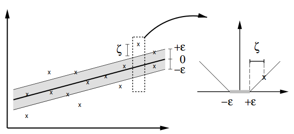
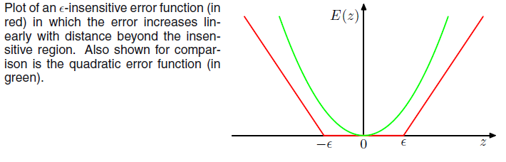
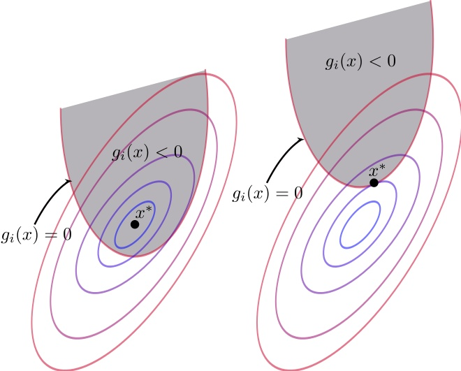
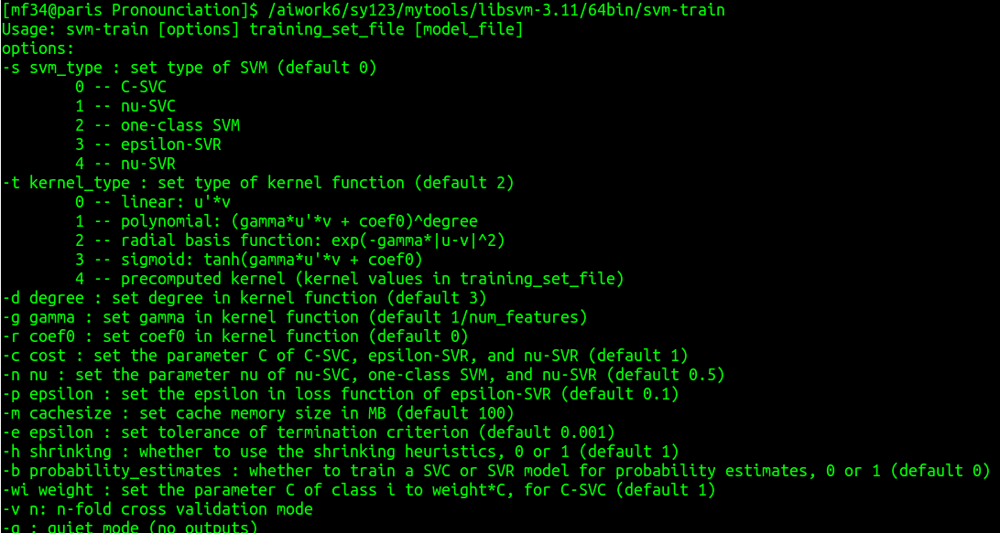

<!-- $theme: default -->

SVR原理浅析
===
# 

##### 方敏
###### 驰声研发部 2018.07

---

# 主要内容
- 目标函数定义
- 对偶问题与kkt条件

---

# 目标函数定义

---

#### 线性svr 
$$\begin{aligned}
&f(x)=w*x + b\\
&w\in R^n; b \in R
\end{aligned}$$
#### 优化目标
$$\begin{aligned}
&min  & \frac{1}{2}\parallel w \parallel^2\\
&s.t. & \begin{cases}
       t-w*x-b\leq\epsilon\\
       w*x+b-t\leq\epsilon \end{cases}
\end{aligned}$$

---

#### 损失函数
$$ E_\epsilon(y(x)-t) =
\begin{cases}
0& \left|w*x+b-t\right|<\epsilon\\
\left|w*x+b-t\right|-\epsilon& other
\end{cases}
$$

---

#### 线性SVR

---

# 目标函数定义
$$\begin{aligned}
&min  & \frac{1}{2}\parallel w \parallel^2+C\sum_{n=1}^{N}(\xi_n+\hat{\xi_n})\\
&s.t. & \begin{cases}
       t-w*x-b-\xi_n \leq \epsilon\\
       w*x+b-t-\hat{\xi_n} \leq \epsilon\\
       \xi_n \geq 0 \\
       \hat{\xi_n}  \geq 0
       \end{cases}
\end{aligned}$$

---

#  对偶问题与kkt条件

---

#### 对偶问题

$$\begin{aligned}
& min_x f(x) & = min_x max_u L(x,u)\\
&  & = max_u min_x L(x,u)\\
\end{aligned}$$

---

#### 拉格朗日乘子法与kkt条件

$$\begin{aligned}
\begin{cases}
min &f(x,y)\\
s.t. & g(x,y)=c
\end{cases} 
\equiv
minF(x)=f(x,y)+\lambda(g(x,y)-c)
\end{aligned}$$

---
#### kkt是拉格朗日乘子法的泛化

$$\begin{aligned}
&\begin{cases}
L(x,\lambda,u)=f(x)+\sum_{i=1}^{n}\lambda_ih_i(x)+\sum_{k=1}^{q}u_kg_k(x)\\
\lambda_i \neq 0\\
h_i(x) = 0\\
u_k \geq 0\\
g_k(x) \leq 0
\end{cases}
\Rightarrow \\

&\begin{cases}
min_xmax_uL(x,\lambda,u) &= max_umin_xL(x,\lambda,u)\\
&=min_xf(x)=f(x^\star)\\
&u_kg_k(x^\star)=0\\
&\frac{\partial L(x,\lambda,u)}{\partial x}|_{x=x^\star}=0

\end{cases}
\end{aligned}$$

---

#### ==Karush-Kuhn-Tucker(KKT)==

---

#### SVR的拉格朗日函数
$$\begin{aligned}
L & = \frac{1}{2}\parallel w \parallel^2 + C\sum_{n=1}^{N}(\xi_n+\hat{\xi_n})\\
& - \sum_{n=1}^{N}a_n(\epsilon+\xi+y_n-t_n)\\
& -\sum_{n=1}^{N}\hat{a_n}(\epsilon+\hat{\xi_n}-y_n+t_n)
\end{aligned}$$

---

---
#### 参考文献
- [【机器学习详解】SVM解回归问题](https://blog.csdn.net/luoshixian099/article/details/51121767】)
- [A Tutorial on Support Vector Regression](http://www.svms.org/regression/SmSc98.pdf)
- [拉格朗日乘子法和KKT条件](http://www.cnblogs.com/zhangchaoyang/articles/2726873.html)

---
# over
## thank you!!!